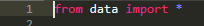

# Membuat program kontak

1.Pertama buat file data kontak seperti gambar berikut

2.kemudian buat fungsi nya menggunakan rumus def seperti gambar berikut

>>Berikut ini penjelasannya :

from data import = berfungsi untuk mengimport program pada data

def tambah = berfungsi untuk menambahkan kontak

def hapus = berfungsi untuk menghapus kontak yang anda inginkan

def daftar = berfungsi untuk menampilkan list atau daftar kontak anda

def cari = berfungsi untuk mencari kontak yang anda inginkan

3.Setelah fungsi di buat kita akan memanggil fungsi tersebut . Berikut ini programnya

>>Berikut ini penjelasannya :

from fungsi import = berfungsi untuk mengimport program yang ada pada fungsi

while True = berfungsi sebagai looping program

cmd = berfungsi sebagai input 

if cmd a = berfungsi untuk memanggil fungsi menambahkan kontak

elif cmd l = berfungsi untuk memanggil fungsi menampilkan kontak

elif cmd s = berfungsi untuk memanggil fungsi mencari kontak

elif cmd d = berfungsi untuk memanggil fungsi hapus kontak

elif cmd q = berfungsi untuk menghentikan program

else = berfungsi untuk menampilkan menu yang tidak terdaftar

print = digunakan untuk menampilkan setelah program di berhentikan

4.Berikut ini tampilan outputnya

